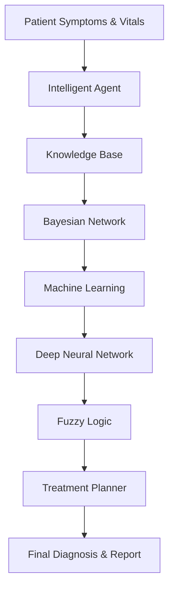

# 🏥 Intelligent Healthcare Diagnostic Assistant AI

An integrated **multi-paradigm Artificial Intelligence healthcare diagnosis system** developed for the **CCS 3101 – Introduction to Artificial Intelligence Capstone Project**.

The system combines **symbolic AI**, **probabilistic reasoning**, **machine learning**, **deep learning**, **fuzzy logic**, and **AI planning** into a unified clinical decision-support pipeline capable of:

- Predicting possible diseases from patient symptoms
- Performing probabilistic diagnosis
- Assessing disease severity
- Generating intelligent treatment recommendations
- Evaluating model performance using standard AI metrics

---

# 📸 Project Demonstration

## End-to-End System Execution

> **Placeholder:** Insert a screenshot of the terminal after running `python app.py`

```text
screenshots/
└── terminal_output.png
```

```markdown

```

---

## Machine Learning Evaluation

> **Placeholder:** Gradient Boosting evaluation showing confusion matrix and feature importance.

```markdown

```

---

## Neural Network Training Curves

> **Placeholder:** Accuracy and Loss curves generated during DNN training.

```markdown

```

---

## Cross-Architecture Performance Comparison

> **Placeholder:** Comparison between Ensemble ML and Deep Neural Network.

```markdown

```

---

# 📌 Project Objectives

The objective of this capstone project is to demonstrate the practical application of multiple Artificial Intelligence paradigms within a healthcare environment by integrating:

- Intelligent Agents
- Rule-Based Expert Systems
- First Order Logic (FOL)
- Forward Chaining
- Backward Chaining
- Bayesian Networks
- Decision Trees
- Random Forests
- Gradient Boosting
- Artificial Neural Networks
- Fuzzy Logic Inference
- STRIPS Planning

---

# ✨ Key Features

- Intelligent patient perception module
- Rule-based disease diagnosis
- Bayesian probabilistic reasoning
- Ensemble Machine Learning classifier
- Deep Neural Network classifier
- Fuzzy Logic severity assessment
- STRIPS treatment planner
- Automated evaluation framework
- Confusion matrix visualization
- Neural network learning curves
- Model comparison plots
- Automatic PDF report generation
- Modular and extensible architecture

---

# 🏗️ System Architecture

The healthcare assistant processes patient information through a sequence of AI modules.



---

# 🧠 AI Modules

| Module | AI Technique | Purpose |
|---------|--------------|---------|
| Module 1 | Intelligent Agent | Patient perception and orchestration |
| Module 2 | First Order Logic | Rule-based diagnosis |
| Module 3 | Bayesian Network | Probabilistic diagnosis |
| Module 4 | Decision Trees / Random Forest / Gradient Boosting | Supervised classification |
| Module 5 | Artificial Neural Network | Deep learning prediction |
| Module 6 | Fuzzy Logic | Severity estimation |
| Module 7 | STRIPS Planner | Treatment planning |

---

# 📂 Project Structure

```text
ai-capstone-healthcare-v2/
│
├── app.py
├── README.md
├── requirements.txt
│
├── modules/
│   ├── agent.py
│   ├── knowledge_base.py
│   ├── bayesian_net.py
│   ├── ml_classifier.py
│   ├── neural_network.py
│   ├── fuzzy_controller.py
│   ├── planner.py
│   ├── search.py
│   ├── rl_agent.py
│   └── nlp_processor.py
│
├── data/
│   ├── diseases.csv
│   └── patients.csv
│
├── evaluation/
│   ├── metrics.py
│   ├── visualizations.py
│   ├── ml_evaluation.png
│   ├── model_comparison.png
│   ├── ml_confusion_matrix.png
│   ├── dnn_confusion_matrix.png
│   └── nn_training.png
│
├── reports/
│   └── final_report.pdf
│
├── screenshots/
│   ├── terminal_output.png
│   ├── ml_evaluation.png
│   ├── model_comparison.png
│   └── nn_training.png
│
├── test_agent.py
├── test_kb.py
├── test_bayesian.py
├── test_ml.py
├── test_nn.py
├── test_fuzzy.py
└── test_planner.py
```

---

# 🚀 Installation

## Clone the Repository

```bash
git clone https://github.com/franklin-mk/ai-capstone.git

cd ai-capstone-healthcare-v2
```

---

## Create Virtual Environment

```bash
python -m venv venv
```

---

## Activate Environment

### Windows (Git Bash)

```bash
source venv/Scripts/activate
```

### Windows CMD

```cmd
venv\Scripts\activate
```

### PowerShell

```powershell
.\venv\Scripts\Activate.ps1
```

### Linux / macOS

```bash
source venv/bin/activate
```

---

## Install Dependencies

```bash
pip install -r requirements.txt
```

---

## Run the Application

```bash
python app.py
```

---

# ▶️ Sample Console Output

```text
RUNNING MASTER END-TO-END CAPSTONE EVALUATION LOOP

Training internal model matrices...

Patient: PT-01 | Expected: covid19         | System Output: covid19
Patient: PT-02 | Expected: meningitis      | System Output: meningitis
Patient: PT-03 | Expected: cardiac_event   | System Output: cardiac_event
Patient: PT-04 | Expected: dengue          | System Output: dengue
Patient: PT-05 | Expected: tuberculosis    | System Output: tuberculosis

-------------------------------------------------------

ML Classifier Performance Audit Report

Accuracy  : 1.0000
Precision : 1.0000
Recall    : 1.0000
F1-Score  : 1.0000

-------------------------------------------------------

Neural Network Performance Audit Report

Accuracy  : 1.0000
Precision : 1.0000
Recall    : 1.0000
F1-Score  : 1.0000

-------------------------------------------------------

Generated Files

✓ evaluation/model_comparison.png

✓ evaluation/ml_confusion_matrix.png

✓ evaluation/dnn_confusion_matrix.png

✓ reports/final_report.pdf

All deliverables successfully checked and recorded!
```

---

# 📊 Generated Outputs

Running the application automatically generates the following deliverables.

| Output | Description |
|----------|------------|
| reports/final_report.pdf | Comprehensive project report |
| evaluation/model_comparison.png | Cross-model performance comparison |
| evaluation/ml_confusion_matrix.png | ML confusion matrix |
| evaluation/dnn_confusion_matrix.png | Neural Network confusion matrix |
| evaluation/ml_evaluation.png | Feature importance & confusion matrix |
| evaluation/nn_training.png | Training accuracy & loss curves |

---

# 🧪 Running Individual Tests

Each AI module can be tested independently.

```bash
python test_kb.py
python test_bayesian.py
python test_ml.py
python test_nn.py
python test_fuzzy.py
python test_planner.py
python test_agent.py
```

---

# 📦 Technologies Used

### Programming

- Python 3.x

### Machine Learning

- Scikit-Learn
- TensorFlow / Keras

### Data Processing

- NumPy
- Pandas

### Visualization

- Matplotlib
- Seaborn

### AI Libraries

- pgmpy
- NetworkX
- SciPy
- NLTK
- Gymnasium

---

# 🧠 Artificial Intelligence Techniques Demonstrated

- Intelligent Agents
- Knowledge Representation
- Rule-Based Systems
- First Order Logic
- Forward Chaining
- Backward Chaining
- Bayesian Inference
- Decision Trees
- Random Forests
- Gradient Boosting
- Artificial Neural Networks
- Deep Learning
- Fuzzy Logic
- STRIPS Planning

---

# 📈 Evaluation Metrics

The project evaluates model performance using:

- Accuracy
- Precision
- Recall
- F1-Score
- Confusion Matrix
- Feature Importance Analysis
- Neural Network Learning Curves
- Cross-Architecture Comparison

---

# 📄 Report Generation

The application automatically generates a professional project report containing:

- Performance metrics
- Patient evaluation summary
- AI model comparisons
- Generated visualization references

Output location:

```text
reports/final_report.pdf
```

---

# 👨‍💻 Author

**Franklin M.**

CCS 3101 – Introduction to Artificial Intelligence

Dedan Kimathi University of Technology

---

# 📜 License

This repository is intended for educational purposes as part of the **CCS 3101 Artificial Intelligence Capstone Project**.

---

# ⭐ Acknowledgements

Special thanks to the Department of Computer Science and the course instructors for providing the opportunity to develop an end-to-end Artificial Intelligence healthcare diagnostic system.

---

# ⭐ If you found this project interesting...

Feel free to ⭐ the repository, fork it, or build upon it for your own AI projects.

Happy Coding! 🚀