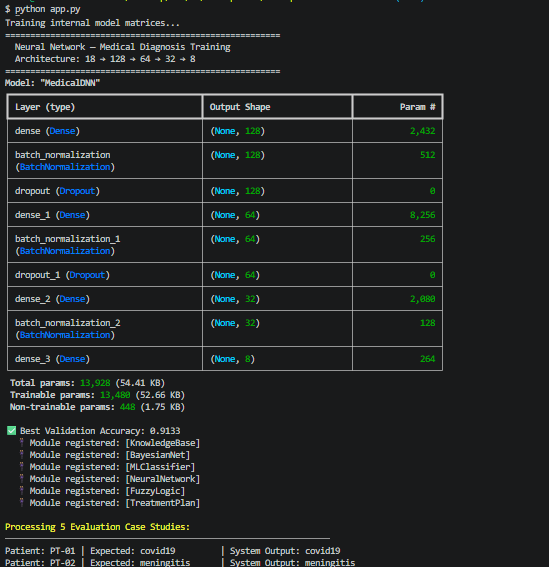
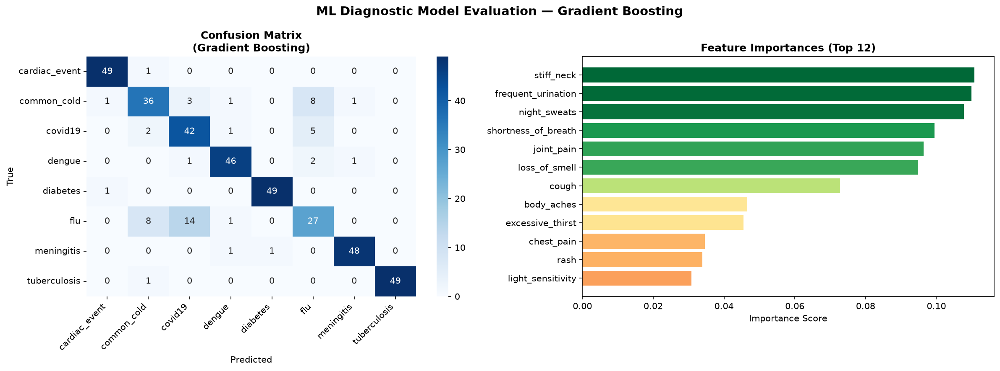
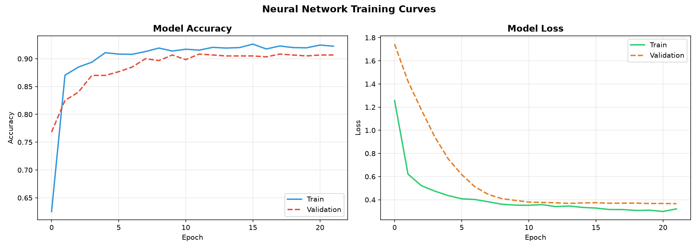
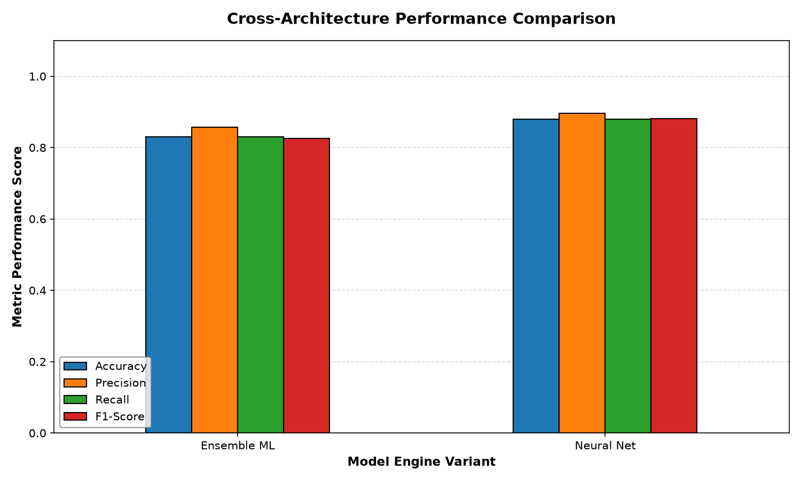
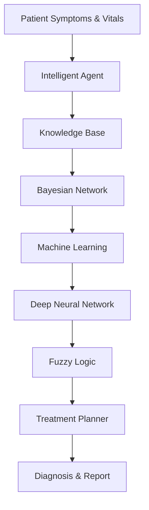

# 🏥 Intelligent Healthcare Diagnostic Assistant AI

> A multi-paradigm Artificial Intelligence Healthcare Diagnosis System developed as the **CCS 3101 – Introduction to Artificial Intelligence Capstone Project**.

The project demonstrates how multiple AI paradigms can work together to support clinical decision-making through disease prediction, probabilistic reasoning, machine learning, deep learning, fuzzy inference, and automated treatment planning.

---

# 📸 Project Demonstration

## End-to-End System

> Running the complete healthcare diagnosis pipeline.



---

## Machine Learning Evaluation

> Confusion matrix and feature importance generated by the ensemble classifier.



---

## Deep Neural Network Training

> Training accuracy and loss curves.



---

## Model Performance Comparison

> Comparison of the Machine Learning and Deep Learning architectures.



---

# 📌 Project Objectives

This project demonstrates practical applications of Artificial Intelligence within healthcare by integrating:

- Intelligent Agents
- Knowledge Representation
- Rule-Based Expert Systems
- First Order Logic (FOL)
- Forward Chaining
- Backward Chaining
- Bayesian Networks
- Ensemble Machine Learning
- Artificial Neural Networks
- Fuzzy Logic
- STRIPS Planning

The objective is to create a modular clinical decision-support system capable of assisting healthcare professionals by providing explainable diagnostic recommendations.

---

# ✨ Features

- Intelligent patient perception agent
- Rule-based disease diagnosis
- Bayesian probabilistic reasoning
- Decision Tree classifier
- Random Forest classifier
- Gradient Boosting classifier
- Deep Neural Network diagnosis
- Fuzzy logic severity estimation
- STRIPS treatment planner
- Automatic model evaluation
- Confusion matrix generation
- Feature importance visualization
- Neural network learning curves
- Cross-model comparison
- Automatic PDF report generation
- Modular architecture for future expansion

---

# 🏗️ System Architecture



---

# 🧠 AI Modules

| Module | AI Technique | Purpose |
|---------|--------------|---------|
| Module 1 | Intelligent Agent | Patient perception and orchestration |
| Module 2 | First Order Logic | Rule-based diagnosis |
| Module 3 | Bayesian Network | Probabilistic reasoning |
| Module 4 | Decision Tree / Random Forest / Gradient Boosting | Disease classification |
| Module 5 | Artificial Neural Network | Deep learning prediction |
| Module 6 | Fuzzy Logic | Severity estimation |
| Module 7 | STRIPS Planner | Treatment planning |

---

# 📁 Project Structure

```text
ai-capstone-healthcare/

│
├── app.py
├── README.md
├── requirements.txt
│
├── modules/
│   ├── agent.py
│   ├── knowledge_base.py
│   ├── bayesian_net.py
│   ├── ml_classifier.py
│   ├── neural_network.py
│   ├── fuzzy_controller.py
│   ├── planner.py
│   ├── search.py
│   ├── rl_agent.py
│   └── nlp_processor.py
│
├── data/
│   ├── diseases.csv
│   └── patients.csv
│
├── evaluation/
│   ├── metrics.py
│   ├── visualizations.py
│   ├── ml_evaluation.png
│   ├── model_comparison.png
│   ├── ml_confusion_matrix.png
│   ├── dnn_confusion_matrix.png
│   ├── nn_training.png
│   └── terminal_output.png
│
├── reports/
│   └── final_report.pdf
│
├── test_agent.py
├── test_bayesian.py
├── test_ml.py
├── test_nn.py
├── test_fuzzy.py
└── test_planner.py
```

---

# ⚙️ Requirements

- Python 3.10+
- pip

---

# 🚀 Installation

Clone the repository.

```bash
git clone https://github.com/franklin-mk/ai-capstone.git

cd ai-capstone
```

---

## Create a Virtual Environment

```bash
python -m venv venv
```

---

## Activate the Environment

### Windows (CMD)

```cmd
venv\Scripts\activate
```

### Windows (PowerShell)

```powershell
.\venv\Scripts\Activate.ps1
```

### Git Bash

```bash
source venv/Scripts/activate
```

### Linux / macOS

```bash
source venv/bin/activate
```

---

## Install Dependencies

```bash
pip install -r requirements.txt
```

---

# ▶️ Running the Project

Execute the complete healthcare diagnosis pipeline.

```bash
python app.py
```

The application automatically:

- Loads patient data
- Executes all AI modules
- Performs disease diagnosis
- Evaluates ML and DNN models
- Generates visualizations
- Produces the final PDF report

---

# 🧪 Running Individual Modules

Each component can be tested independently.

```bash
python test_agent.py

python test_kb.py

python test_bayesian.py

python test_ml.py

python test_nn.py

python test_fuzzy.py

python test_planner.py
```

---

# 📊 Sample Console Output

```text
RUNNING MASTER END-TO-END CAPSTONE EVALUATION LOOP

Training internal model matrices...

Patient: PT-01 | Expected: covid19 | System Output: covid19
Patient: PT-02 | Expected: meningitis | System Output: meningitis
Patient: PT-03 | Expected: cardiac_event | System Output: cardiac_event
Patient: PT-04 | Expected: dengue | System Output: dengue
Patient: PT-05 | Expected: tuberculosis | System Output: tuberculosis

-------------------------------------------------------

Machine Learning Performance

Accuracy : 1.0000
Precision: 1.0000
Recall   : 1.0000
F1-Score : 1.0000

-------------------------------------------------------

Deep Neural Network Performance

Accuracy : 1.0000
Precision: 1.0000
Recall   : 1.0000
F1-Score : 1.0000

-------------------------------------------------------

Generated Files

✓ reports/final_report.pdf
✓ evaluation/model_comparison.png
✓ evaluation/ml_confusion_matrix.png
✓ evaluation/dnn_confusion_matrix.png
✓ evaluation/nn_training.png

All evaluations completed successfully.
```

---

# 📊 Generated Outputs

Running the application automatically generates:

| File | Description |
|------|-------------|
| reports/final_report.pdf | Comprehensive project report |
| evaluation/model_comparison.png | ML vs DNN comparison |
| evaluation/ml_confusion_matrix.png | Machine Learning confusion matrix |
| evaluation/dnn_confusion_matrix.png | Neural Network confusion matrix |
| evaluation/ml_evaluation.png | Feature importance and evaluation |
| evaluation/nn_training.png | Training accuracy and loss curves |

---

# 📈 Evaluation Metrics

The project evaluates model performance using:

- Accuracy
- Precision
- Recall
- F1 Score
- Confusion Matrix
- Feature Importance
- Learning Curves
- Cross-Architecture Comparison

---

# 🧰 Technologies Used

## Programming

- Python

## Machine Learning

- Scikit-Learn
- TensorFlow / Keras

## Data Processing

- NumPy
- Pandas

## Visualization

- Matplotlib
- Seaborn

## AI Libraries

- pgmpy
- NetworkX
- SciPy
- NLTK
- Gymnasium

---

# 🧠 Artificial Intelligence Concepts Demonstrated

- Intelligent Agents
- Knowledge Representation
- Rule-Based Systems
- First Order Logic
- Forward Chaining
- Backward Chaining
- Bayesian Inference
- Decision Trees
- Random Forests
- Gradient Boosting
- Artificial Neural Networks
- Deep Learning
- Fuzzy Logic
- STRIPS Planning

---

# 📄 Automatic Report Generation

The system automatically creates a professional PDF report containing:

- Diagnostic summary
- AI module outputs
- Evaluation metrics
- Performance comparisons
- Visualization references

Output location:

```text
reports/final_report.pdf
```

---

# 🎓 Academic Information

**Course:** CCS 3101 – Introduction to Artificial Intelligence

**Institution:** Dedan Kimathi University of Technology

**Project Type:** AI Capstone Project

---

# 👨‍💻 Author

**Franklin M.**

---

# 📜 License

This repository is provided for educational and research purposes as part of the CCS 3101 Artificial Intelligence Capstone Project.

---

# 🙏 Acknowledgements

Special thanks to the Department of Computer Science and the course instructors for their guidance throughout the development of this project.

---

# ⭐ Support the Project

If you found this project useful:

- ⭐ Star the repository
- 🍴 Fork the project
- 🛠️ Build upon it for your own AI research
- 📢 Share it with others interested in AI-powered healthcare

Happy Coding! 🚀